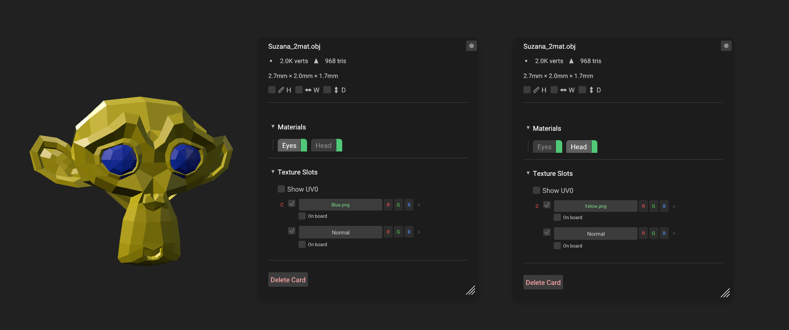
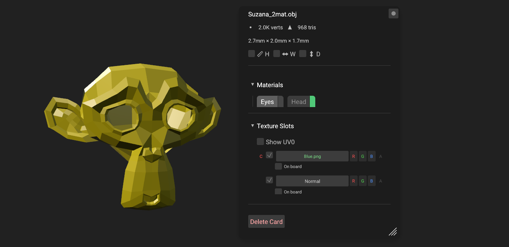
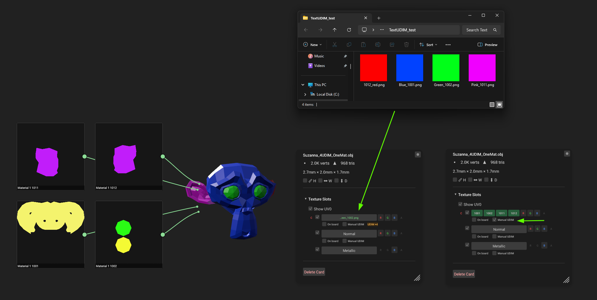
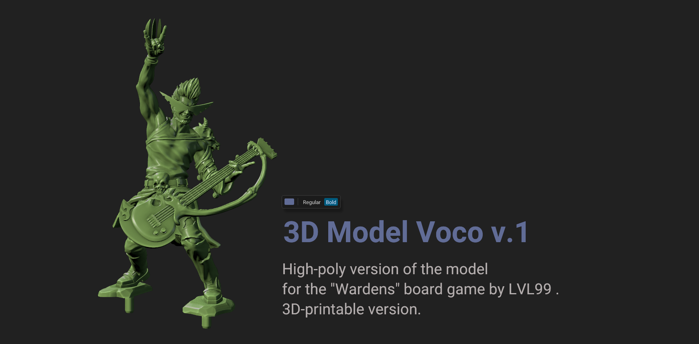

# MeshGarage - User Guide

Application version: 0.9.0 Beta

---

## What is MeshGarage

MeshGarage is an infinite 2D board for viewing and analyzing 3D models. You drag model files onto the board, and each one becomes a card with its own local 3D space. You can rotate the model, switch display modes, inspect textures, UV layouts, and more. The cards themselves can be moved and resized.

You can also place reference images or concept art on the same board next to the models to compare them with finished assets, as well as create text notes. The board opens quickly and can load large numbers of high-poly and low-poly 3D models.

Problems the application solves:

- **quickly inspect 3D models** - UV layouts, PBR texture maps, UDIMs, and more, without launching a heavy 3D package;
- **compare several model variants side by side** - lighting is shared across the board, so every model is shown under the same conditions;
- **keep many high-poly models on the board at once** - sculpts and scans with millions of polygons can be opened simultaneously without interfering with each other because they exist in separate spaces;
- **quickly browse a large 3D kitbash library** - drag a folder containing 3D models onto the board, and all supported files inside it will be loaded automatically;
- **evaluate and compare generated 3D models**;
- **build a project workboard** from models, references, and notes.

### Five concepts everything is built around

| Concept        | What it is                                                                                                                         |
| -------------- | ---------------------------------------------------------------------------------------------------------------------------------- |
| **Board**      | An infinite canvas. Pan with the middle mouse button and zoom with the mouse wheel.                                                |
| **Card**       | A local 3D space containing a 3D model.                                                                                            |
| **Card Menu**  | All settings for a specific model. Open it by right-clicking the card.                                                             |
| **Board Menu** | Background, light source, and AO shadow settings. Open it by right-clicking an empty area of the board.                            |
| **Project**    | A saved board: `.meg` (a lightweight file containing links to 3D models and images) or `.meprj` (an archive containing all files). |

---

## Contents

1. [Installation](#1-installation)
2. [5-Minute Quick Start](#2-5-minute-quick-start)
3. [Basics: Board, Cards, Menus](#3-basics-board-cards-menus)
4. [Working with a Model](#4-working-with-a-model)
5. [Lighting](#5-lighting)
6. [Textures and Materials](#6-textures-and-materials)
7. [UV and UDIM](#7-uv-and-udim)
8. [Keeping Things Organized: Outliner, References, Notes](#8-keeping-things-organized-outliner-references-notes)
9. [Saving and Sharing](#9-saving-and-sharing)
10. [Customizing Hotkeys](#10-customizing-hotkeys)
11. [Reference: Mouse and Keyboard](#11-reference-mouse-and-keyboard)
12. [Board Menu (right-click an empty area)](#12-board-menu-right-click-an-empty-area)
13. [Supported Formats](#13-supported-formats)
14. [Frequently Asked Questions and Issues](#14-frequently-asked-questions-and-issues)
15. [Application Files: Cache and Logs](#15-application-files-cache-and-logs)
16. [About](#16-about)

---

## 1. Installation

### System Requirements

|        | Minimum                                     | Recommended                            |
| ------ | ------------------------------------------- | -------------------------------------- |
| OS     | Windows 10 64-bit                           | Windows 11 64-bit                      |
| GPU    | DirectX 12 or Vulkan support, **4 GB VRAM** | RTX GPU with 8 GB VRAM or more         |
| Memory | 8 GB RAM                                    | 16 GB RAM                              |
| Disk   | 30 MB for the application                   | plus space for the 3D model cache (GB) |

For normal use - several models with 2K textures - 4 GB of VRAM is enough. More is only required if you build boards containing dozens of heavy models with 4K UDIM sets.

### Option 1: Installer

1. Run `MeshGarage-0.9.0-Setup.exe`. Administrator privileges are not required.
2. The setup wizard will ask for the installation folder and model cache folder, and will offer file association options.
3. Associations for `.meg` and `.meprj` (MeshGarage's own project formats) are always enabled. Associations for 3D formats (`.fbx`, `.obj`, `.glb`, `.gltf`, `.stl`) are optional, and they **do not take ownership** of those formats from your main applications: MeshGarage is only added to the **Open with** menu.

### Option 2: Portable

1. Extract `MeshGarage-0.9.0-portable.zip` into any folder where you have write access.
2. Run `MeshGarage.exe`. The cache will be stored in a `.cache` subfolder next to the application, so the entire folder can be moved to another drive or computer.

### First Launch

An empty board will open. In the upper-left corner is the **File** menu for opening and saving. On the right is the **?** button for Help, where you can change hotkeys, followed by the minimize, maximize, and close buttons.

On subsequent launches, MeshGarage automatically restores the board settings exactly as you left them. You can reset the settings from the Board Menu using:

**Reset Background**  
**Reset Global Lighting**

---

## 2. 5-Minute Quick Start

Go through this once. Everything else will be intuitive afterward.

1. **Drop in a model.** Drag `.glb`, `.fbx`, `.obj`, or `.stl` files from File Explorer onto the board. Cards containing the 3D models will appear.
2. **Navigate.** Hold the **right mouse button** over a card and move the mouse to rotate the model. Use the left mouse button to move the card. The mouse wheel zooms the entire board.
3. **Switch shaders.** Click a card and press **1** (Clay shader), **2** (PBR shader), or **3** (Normals visualization).
4. **Move the lights.** Hold **Q** and move the mouse - the Key Light follows the cursor. The same applies to **W** for Fill Light and **E** for Rim Light. While holding the hotkey for a light, use the mouse wheel to adjust its intensity.
5. **Open the settings.** Right-click the card to open the Card Menu: mesh statistics, materials, texture slots, AO shadows.
6. **Save.** Choose **File → Save Project...** - the entire board will be saved into a single `.meprj` file that you can open later or send to someone else.

Done. The following sections cover each topic in detail.

---

## 3. Basics: Board, Cards, Menus

### Board

- **Pan:** hold the middle mouse button and move the mouse.
- **Zoom:** use the mouse wheel. The entire board changes scale.

### Cards

- **Select:** left-click.
- **Move:** drag the card with the left mouse button.
- **Resize:** hold Shift + right mouse button and drag.
- **Clone:** hold Alt + left mouse button and drag the card.
- **Delete:** select a card and press **Delete**. The original file on disk is not affected.

### Multiple Cards at Once

- **Select multiple cards:** hold the left mouse button and drag a selection rectangle around several cards.
- **Add/remove from selection:** Ctrl + click a card.
- A selected group moves and rotates together, and Card Menu changes are applied to the entire group when multiple cards are selected. For example, you can switch several cards to Clay mode at once or rotate several models simultaneously for comparison.

### Two Menus

Almost all controls are grouped into two context menus:

- **Right-click a card** → Card Menu: shading, materials, texture slots, UV, shadows. The title shows the model name, followed by vertex/triangle counts and dimensions.
- **Right-click an empty area** → Board Menu: background color, grid, vignette, and studio lighting.

Both menus are floating windows: you can drag them by the title bar, resize them from the edge, and **pin them** with the pin icon. A pinned menu stays open while you work with the board.

**Ctrl + mouse wheel** over a menu changes the scale of its contents.

---

## 4. Working with a Model

### Loading

Use any of the following methods:

- drag a file - or several files at once - onto the board;
- drag a **folder** onto the board - MeshGarage recursively imports all supported models inside it;
- double-click an empty area of the board with the left mouse button to open the file picker;
- choose **File → Open Project or Model...**

Models are imported in the background: the card appears immediately while its content continues loading. Opening the same model again is instant because the cache is used (see Section 15).

| Action                                          | How   |
| ----------------------------------------------- | ----- |
| Center the selected card relative to the screen | **F** |
| Reset model rotation to its original state      | **R** |

### Display Modes

| Key   | Mode        | Purpose                                                                                                               |
| ----- | ----------- | --------------------------------------------------------------------------------------------------------------------- |
| **1** | **Clay**    | Lightweight shader where the surface uses only Color and Rough/Gloss. Suitable for HighPoly models without UVs.       |
| **2** | **PBR**     | Full material: textures, albedo, metallic, roughness, reflections, normal, AO, emission, Alpha (Opacity), Specular.   |
| **3** | **Normals** | Color represents the normal direction. Smoothing errors and flipped polygons immediately appear as sharp color seams. |

In the Clay section of the Card Menu, you can change **Clay Color** and the **Gloss / Plastic** slider.

The `[` and `]` hotkeys change the **Gloss / Plastic** value in any display mode.

#### PBR Material Settings

The shading is physically based and uses the metallic/roughness workflow. The Card Menu contains these sliders:

- **Base Color** - surface color. If an Albedo map is enabled, this acts as a tint applied over it. Pure white leaves the texture unchanged.
- **Roughness** - surface roughness: 0 means polished with sharp, bright highlights; 1 means matte with broad, dim highlights. If a Roughness map is used, the value comes from the texture.
- **Metallic** - metalness: 0 means dielectric material (plastic, wood, fabric), while 1 means metal, with reflections tinted by the surface color. As with Roughness, an enabled Metallic map takes priority over the slider.
- **Specular Level** - reflection strength for non-metals. Useful for skin, fabric, and rough materials; it does not affect pure metal.
- **Clear Coat** - a second glossy layer above the base material: automotive clear coat, lacquered plastic, wet surfaces.
- **Clear Coat Roughness** - blur of the highlights in the clear-coat layer: 0 means mirror-like clear coat, 1 means a matte coating.

### Information Options

In the Card Menu:

- **Wireframe Overlay** - displays mesh edges over the shading. It shows the **original mesh from the model**. Wireframe is unavailable for meshes heavier than 5 million triangles.
- **Vertex and triangle counters** appear in the Card Menu header.
- **H / W / D** checkboxes enable height, width, and depth rulers directly next to the model on the board. The displayed units provide exact physical dimensions for 3D printing.

### Normal Smoothing

If the file does not contain authored normals - for example scans, STL files, or CAD exports - the Card Menu shows a **Smooth Normals** option for automatic smoothing. MeshGarage never replaces authored smoothing groups.

> **Note.** MeshGarage does not modify models that already contain UVs, normals, or textures. All optimizations happen only on the rendering side.

---

## 5. Lighting

Lighting in MeshGarage is **shared across the entire board**. All models are lit identically, allowing fair comparison. The lighting setup is a classic three-point arrangement:

**key** (main),  
**fill** (fill),  
**rim** (back/rim).

### Changing Light Position and Intensity with Hotkeys

1. Hold **Q** and move the mouse - the **Key Light** follows the cursor across the front hemisphere of the model.
2. Use the mouse wheel while holding **Q** to change the light intensity.
3. Release the key to lock the light in place.
4. **W** works the same way for **Fill Light** and moves it across the front hemisphere.
5. **E** controls **Rim Light**, which always moves behind the model across the rear hemisphere.

### More Precise Lighting Controls in the Board Menu

Right-click an empty area of the board. In the **Studio Lights** section you will find three panels: **Key Light / Fill Light / Rim Light**. Each has a position Gizmo, light intensity, and light color controls. **Reset Global Lighting** restores the default lighting setup.

> **Tip.** A useful combination is a warm Key Light + cool Fill Light + neutral Rim Light. If you need to evaluate texture colors accurately, set all lights to white.

**Ambient** - uniform illumination applied to all surfaces. Keep it low for dramatic lighting, or raise it for flatter, catalog-style lighting.

### Ray-Traced Shadows (RT Shadow)

To add depth to models, you can enable proper contact AO shadows calculated using ray tracing:

1. Card Menu → enable **RT Shadow**.
2. The shadow progressively refines over time. A pass counter is displayed nearby, and the noise disappears within a few seconds.
3. **RT Shadow Strength** - shadow density.
4. **RT Shadow Color** - shadow color.

Shadows are calculated separately for each card and recalculated when the model rotates.

> **Note.** It is better to keep this disabled when quickly browsing dozens of models.

### AO Shadow

An alternative option for real-time AO shadows uses the GTAO algorithm. The option is located in the Board Menu and applies to all models on the board at once.

- **Enable AO Shadow** - enable the effect.
- **AO Intensity** (0–3) - how dark the occlusion is: 0 means no effect, 1 is a natural level, and higher values produce a more stylized result.
- **AO Radius** (0.05–3) - how far the occlusion extends from each point: a small radius creates narrow shadows in tight gaps and folds, while a large radius creates broader shading in large cavities.
- **AO Contrast** (0.2–4) - sharpness of the occlusion boundary: higher values produce harder shadow edges.

---

## 6. Textures and Materials

Open the Card Menu by right-clicking a model card, then find the **Texture Slots** section. If the model does not have UV tiles, this section is hidden.

### Slots

There are eight slots: **Albedo, Normal, Metallic, Roughness, AO, Emissive, Alpha, Specular**. When a model is imported, they are populated automatically from the model material, nearby texture folders, the `.mtl` file for OBJ, or embedded GLB textures. For automatic detection, texture files must use suffixes that match their slot, for example `robot_normal.png` or `robot_ao.png`.

Otherwise, texture maps can be dragged directly into slots with the mouse, or you can click a slot and choose a file from disk.

Each slot has:

- a **checkbox** - temporarily disables the map without losing its path. This is a quick way to see exactly what a normal map contributes: turn it off, turn it back on, compare;
- **C** (clear) - clears the slot;
- **R / G / B / A** - selects which texture channel provides the data;
- a **UV channel** selector (UV0/UV1/UV2) - selects which UV layout is used for the loaded textures. Each UV channel has its own texture slots. If the model contains more than one UV channel, **Texture Slots** shows a separate tab for each channel;
- **on board** - enables display of the texture on the board as a node connected to the model.

If the model contains several materials, the menu shows a tab for each one. The green edge of a tab is a button that hides the geometry using that material.

### Packed Textures (ORM)

Metallic, Roughness, and AO are often packed into different channels of a single texture. Load the same file into all three slots and select the corresponding channels (**AO → R**, **Roughness → G**, **Metallic → B**).

### If the Model Looks Incorrect

- **OpenGL Normal Map** - switches Normal Map interpretation to the **OpenGL** format.
- **Flip U / Flip V** - mirrors the texture along either axis.

### Replacing Textures

Embedded `.GLB` textures behave the same way as external files. They can also be replaced and restored using the **C** button.

[SCREENSHOT: Texture Slots section: three slots use the same ORM file with R/G/B channels, Normal is disabled with the checkbox]

---

## 7. UV and UDIM

UV tools appear only for models that contain a UV layout.

### Viewing the UV Layout

1. Card Menu → **Texture Slots** section → enable **Show UV**. The active UV channel is shown next to it.
2. A node containing the UV layout appears on the board next to the card, connected to it by a line.
3. Nodes are regular board objects: move them with the left mouse button and resize them by dragging the corners.

If a model has multiple UV channels (for example, a lightmap or a detail layer), they are displayed as separate tabs. Each tab has a green toggle on the right. When enabled, that UV channel is always displayed on top of the previous ones. Multiple UV channels are often used for decals or baked lighting.

### UDIM

If the UV layout occupies tiles 1001, 1002, and so on, MeshGarage detects this automatically. This allows you to drop the corresponding set of UDIM textures into a single slot.

A **Manual UDIM** checkbox also appears under each slot. When enabled, the slot is divided into several smaller cells for manually loading a texture for each tile. Assigned tiles are highlighted in green.

> **Note.** If UV islands are scattered far outside the tiles without any consistent system, MeshGarage treats the layout as unpacked and hides the UDIM tools to avoid showing meaningless controls.

---

## 8. Keeping Things Organized: Outliner, References, Notes

### Outliner - Hide Parts of a Model

Press **O** to open a panel on the left containing the structure of all cards:

**card → materials → geometry assigned to a material**

Geometry names come from the source file.

Click the green square to hide the selected element - for example, if you need to inspect a character without a helmet. Click it again to show the element.

### Raster Images

You can also drag raster images onto the board. For example, use them to compare 3D models against concept art or simply as references.

- Drag an image (`.png`, `.jpg`, `.tga`, `.bmp`, `.tiff`, `.webp`) onto the board.
- Move the card with the **left mouse button**.
- Resize the card by holding **Shift + right mouse button** and moving the mouse.
- Repeatedly pressing **Alt + left-click** cycles what is shown: filename → resolution → both labels.

### Text Notes

1. Press **T** - the cursor switches to text mode. In this mode, the mouse wheel sets the font size before you click the board and start typing.
2. Click an empty area and start typing.
3. Press **Esc** to exit text mode.
4. To edit an existing note, select it and double-click it with the left mouse button, or click the pencil icon next to it in the Outliner.
5. Resize a note with **Shift + right mouse button**.

If you paste text onto the board using **Ctrl+V**, a note is created automatically.

---

## 9. Saving and Sharing

### Two Project Formats

Open the menu by clicking **File** in the upper-left corner.

|               | `.meg`  Save File...                                           | `.meprj`  Save Project...                                                                                                                                |
| ------------- | -------------------------------------------------------------- | -------------------------------------------------------------------------------------------------------------------------------------------------------- |
| What's inside | Board layout, settings, and **links** to files in your folders | Board layout, settings, and the **files themselves**: models and textures are arranged into folders with correct naming and packed into a single archive |
| When to use   | Personal work on your own computer                             | Send to a colleague, archive a project, or move it to another computer                                                                                   |

To open a project, choose **File → Open Project or Model...**, double-click the file in File Explorer, or simply drag a `.meg` / `.meprj` file into the application window. Before replacing the current board, the application asks for confirmation.

---

## 10. Customizing Hotkeys

All keys and gestures can be reassigned: click the **?** button in the window header → **About** → **Keyboard Shortcuts**.

The window contains three sections:

- **Keyboard keys** - action keys for lighting, display modes, and tools. Click a field and press a new key.
- **Modifier keys** - modifiers used by mouse gestures: cloning, multi-selection, resizing, and menu scaling.
- **Mouse buttons** - selects which mouse button pans the board and which one drags the application window.

The **Reset to defaults** button restores the original settings.

---

## 11. Reference: Mouse and Keyboard

### Mouse

| Action                          | Where           | Result                                   |
| ------------------------------- | --------------- | ---------------------------------------- |
| Left-click                      | card            | Select                                   |
| Left-button drag                | card            | Move card / group                        |
| Alt + left-button drag          | card            | Clone and drag the copy                  |
| Ctrl + left-click               | card            | Add/remove from multi-selection          |
| Left-button drag                | empty board     | Selection rectangle                      |
| Double left-click               | empty board     | Open file dialog                         |
| Right-click                     | card            | Card Menu                                |
| Right-button drag               | card            | Rotate camera                            |
| Shift + right-button drag       | card, reference | Resize                                   |
| Right-click                     | empty board     | Board Menu                               |
| Right-button drag               | empty board     | Move the application window              |
| Middle-button drag              | anywhere        | Pan the board                            |
| Mouse wheel                     | anywhere        | Zoom board toward cursor                 |
| Mouse wheel while holding Q/W/E | —               | Adjust the corresponding light intensity |
| Ctrl + mouse wheel              | over menu       | Scale menu contents                      |
| Alt + click                     | image           | Toggle label display (name/resolution)   |

### Keyboard (Default)

| Key                          | Action                                                                    |
| ---------------------------- | ------------------------------------------------------------------------- |
| **Q** / **W** / **E** (hold) | Key / Fill / Rim light: mouse controls position, wheel controls intensity |
| **1** / **2** / **3**        | Clay / PBR / Normals mode                                                 |
| `[` / `]`                    | Decrease / increase roughness                                             |
| **F**                        | Center selected items on the board                                        |
| **R**                        | Reset camera angle for 3D cards                                           |
| **O**                        | Outliner panel                                                            |
| **T**                        | Note tool                                                                 |
| **Delete**                   | Delete selection                                                          |
| **Esc**                      | Exit note tool                                                            |

---

## 12. Board Menu (right-click an empty area)

| Section       | Contents                                                 |
| ------------- | -------------------------------------------------------- |
| Base Color    | Board background color                                   |
| Vignette      | Darkening around the edges                               |
| Guides        | Visual division of the board horizontally and vertically |
| Grid          | Background grid                                          |
| AO Shadow     | Real-time AO shadow for 3D models                        |
| Studio Lights | Key / Fill / Rim: position Gizmo, intensity, color       |
| Footer        | Reset Background, Reset Global Lighting                  |

---

## 13. Supported Formats

### Models

| Format     | Geometry | Materials and Textures                               | Multiple UV Channels |
| ---------- | -------- | ---------------------------------------------------- | -------------------- |
| glTF / GLB | yes      | full PBR, including embedded textures                | yes                  |
| FBX        | yes      | yes, plus automatic texture search in nearby folders | yes                  |
| OBJ        | yes      | via `.mtl` and automatic search                      | yes                  |
| STL        | yes      | no (geometry only)                                   | —                    |

### Images (References)

`.png`, `.jpg`, `.jpeg`, `.tga`, `.bmp`, `.tiff`, `.webp`

### Projects

`.meg` (links), `.meprj` (archive). Open them by dragging them into the application, using **File → Open**, or double-clicking them in File Explorer.

---

## 14. Frequently Asked Questions and Issues

**I re-exported the model. Will I see the new version?**  
Yes, automatically. The cache is tied to the file contents, so a modified file is re-imported automatically. If something still appears outdated, choose **File → Clear Cache...** and open the file again.

**The application has started slowing down.**  
Sometimes very heavy models containing tens of millions of polygons take a while to process during the first import. This happens only once; subsequent loads use the cache.

---

## 15. Application Files: Cache and Logs

**Model cache.** To make reopening heavy files instant, models are stored in a cache:

- when installed using Setup, the cache is stored by default in `%LOCALAPPDATA%\MeshGarage\cache`, although you can choose another folder during installation;
- in the portable version, the cache is stored in the `.cache` folder next to `MeshGarage.exe`.

The cache maintains itself: modified files are re-imported and outdated entries are removed. To clear it completely, choose **File → Clear Cache...** and confirm. The models will simply be re-imported the next time they are opened.

**Logs.** `MeshGarage.log`, located next to the application, is the regular application log. `crash_log.txt` is created only after a crash.

**Session.** The latest board settings are saved when the application exits and restored automatically on the next launch.

---

## 16. About

The **?** button in the upper-right corner opens the **About** window with the version, developer information, and beta status. From there you can access:

- **Third-Party Licenses** - licenses for third-party software;
- **Keyboard Shortcuts** - view and reassign all keys and gestures.

When reporting an issue, attach `crash_log.txt` and `MeshGarage.log` (located next to `MeshGarage.exe`) and, if possible, the model file itself.
