# MeshGarage - руководство пользователя

Версия приложения: 0.9.0 Beta

---

## Что такое MeshGarage

Бесконечная 2D доска для просмотра и анализа 3D-моделей. Вы перетаскиваете на неё файлы, и каждый из них превращается в карточку со своим локальным 3D пространством. Модель можно вращать, переключать режимы отображения, просматривать текстуры, UV-развёртку и другое. Сами карточки можно перемещать и масштабировать. 

Рядом на ту же доску можно класть картинки-референсы или концепты для сравнения с готовыми моделями. Также, создавать текстовые заметки. Доска быстро открывается и позволяет загружать большое количества highpoly и lowpoly 3D моделей.

Проблемы которые решает приложение:

- **быстро проверить 3D модели**  (развёртку, PBR текстурные карты, UDIM и другое, не запуская тяжёлый 3D-пакет.
- **сравнить несколько вариантов** модели бок о бок - свет на доске общий, условия у всех одинаковые;
- **держать на доске сразу много хайполи-моделей** - скульпты и сканы на миллионы полигонов открываются одновременно и не мешают друг другу так находятся в разных пространствах;
- **быстро перебрать большую библиотеку 3D китбашей** - перетащите папку c 3D моделями, и все файлы из нее автоматически загрузятся на доску;
- **оценивать и сравнивать сгенерированные 3D модели**
- **собрать рабочую доску проекта** из моделей, референсов и заметок;

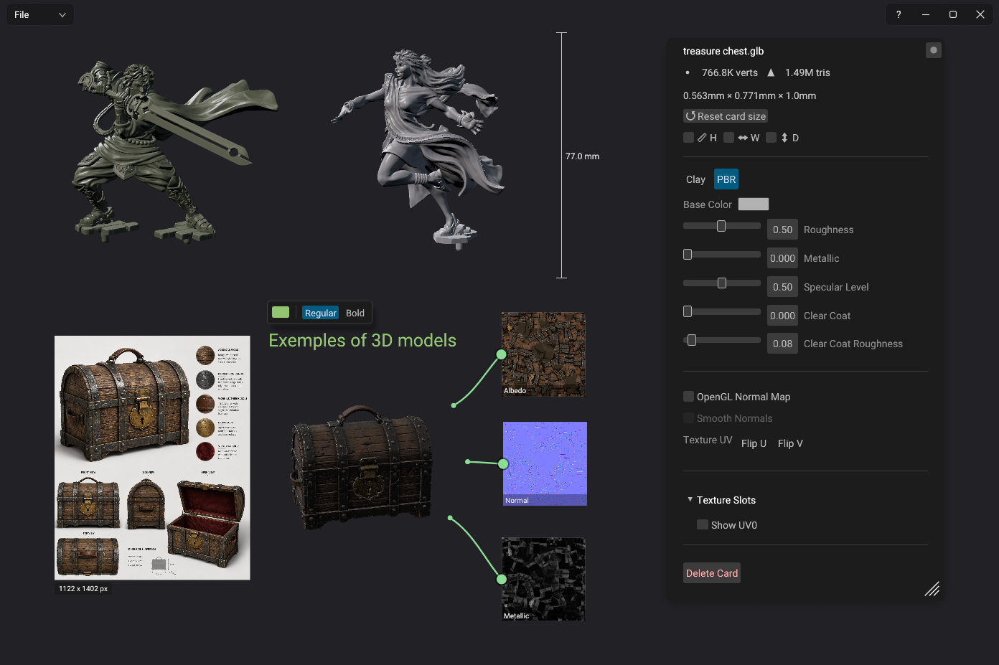

### Пять понятий, на которых всё строится

| Понятие           | Что это                                                                                                                   |
| ----------------- | ------------------------------------------------------------------------------------------------------------------------- |
| **Доска**         | Бесконечный холст. Двигается средней кнопкой мыши, зумится колесом.                                                       |
| **Карточка**      | локальное 3D пространство с 3D моделью.                                                                                   |
| **Меню карточки** | Все настройки выбранной модели. Открывается кликом ПКМ по карточке.                                                      |
| **Меню доски**    | Настройка фона, источников света и AO тени . Открывается кликом ПКМ по пустому месту доски.                               |
| **Проект**        | Сохранённая доска: `.meg` (лёгкий файл со ссылками на 3D модели и картинки) или `.meprj` (архив со всеми файлами внутри). |

---

## Содержание

1. [Установка](#1-установка)
2. [Быстрый старт за 5 минут](#2-быстрый-старт-за-5-минут)
3. [Основы: доска, карточки, меню](#3-основы-доска-карточки-меню)
4. [Работа с моделью](#4-работа-с-моделью)
5. [Свет](#5-свет)
6. [Текстуры и материалы](#6-текстуры-и-материалы)
7. [UV и UDIM](#7-uv-и-udim)
8. [Наведение порядка: Outliner, референсы, заметки](#8-наведение-порядка-outliner-референсы-заметки)
9. [Сохранение и обмен](#9-сохранение-и-обмен)
10. [Настройка горячих клавиш](#10-настройка-горячих-клавиш)
11. [Справочник: мышь и клавиатура](#11-справочник-мышь-и-клавиатура)
12. [Меню доски (ПКМ по пустому месту)](#12-справочник-меню-карточки-и-меню-доски)
13. [Поддерживаемые форматы](#13-поддерживаемые-форматы)
14. [Частые вопросы и проблемы](#14-частые-вопросы-и-проблемы)
15. [Файлы программы: кеш и логи](#15-файлы-программы-кеш-и-логи)
16. [О программе](#16-о-программе)

---

## 1. Установка

### Системные требования

|            | Минимум                                           | Комфортно                          |
| ---------- | ------------------------------------------------- | ---------------------------------- |
| ОС         | Windows 10 64-bit                                 | Windows 11 64-bit                  |
| Видеокарта | с поддержкой DirectX 12 или Vulkan, **4 GB VRAM** | RTX 8 GB VRAM и больше             |
| Память     | 8 GB RAM                                          | 16 GB RAM                          |
| Диск       | 30 MB для программы                               | плюс место под кеш 3D моделей (GB) |

Для обычной работы - несколько моделей с 2K-текстурами, достаточно 4 GB видеопамяти. Больше нужно, только если вы собираете доски из десятков тяжёлых моделей с 4K UDIM-сетами.

### Вариант 1: установщик

1. Запустите `MeshGarage-0.9.0-Setup.exe`. Права администратора не требуются.
2. Мастер спросит папку установки, папку для кеша моделей и предложит галки ассоциаций файлов.
3. Ассоциации `.meg` и `.meprj` (собственные проекты MeshGarage) включаются всегда. Ассоциации 3D-форматов (`.fbx`, `.obj`, `.glb`, `.gltf`, `.stl`)  по желанию, и они **не отбирают** формат у ваших основных программ: MeshGarage лишь добавляется в меню «Открыть с помощью».

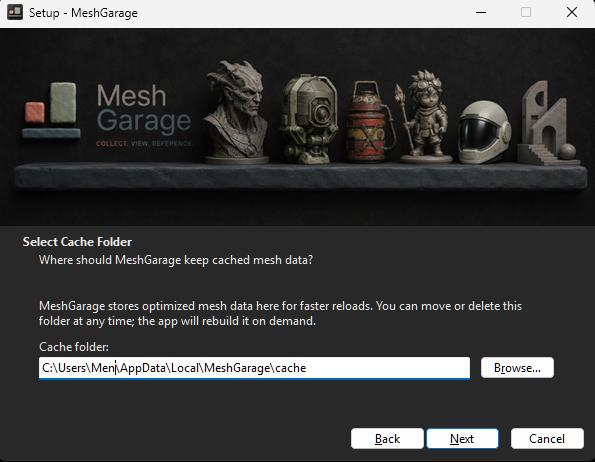.

### Вариант 2: portable

1. Распакуйте `MeshGarage-0.9.0-portable.zip` в любую папку с правами на запись.
2. Запустите `MeshGarage.exe`. Кеш будет храниться в подпапке `.cache` рядом - папку можно целиком переносить на другой диск или компьютер.

### Первый запуск

Откроется пустая доска. Сверху слева - меню **File** (меню открытия и сохранения), справа - кнопки **?** (справка) в которой можно настроить поменять горячие клавиши, свернуть, развернуть, закрыть.

При следующих запусках MeshGarage сам восстановит настройки доски такими, как вы их оставили. Настройки можно сбросить в меню вменю доски кнопками:
**Reset Background**
**Reset Global Lighting**

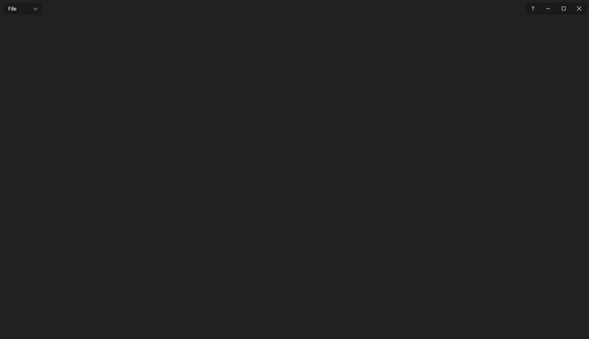

---

## 2. Быстрый старт за 5 минут

Пройдите один раз - дальше всё остальное будет интуитивно.

1. **Закиньте модель.** Перетащите `.glb`, `.fbx`, `.obj` или `.stl` файлы из проводника на доску. Появятся карточки с 3D моделями. 
2. **Навигация.** Зажмите **правую кнопку мыши** на карточке и двигайте мышь - модель будет вращаться. Левой кнопкой мыши переместите карточку. Колесо мыши масштабирует всю доску.
3. **Переключите шейдер.** Кликните карточку и нажмите **1** (Clay шейдер), **2** (PBR шейдер), **3** (Normals - визуализация нормалей).
4. **источники света** Удерживайте **Q** и двигайте мышь - Key Light будет двигаться с мышью.  То же самое: **W** - Fill Light, **E** - Rim Light. Если крутить колесо мыши при зажатой горячей клавиши какого либо источника света, то можно отрегулировать его яркость.
5. **Загляните в настройки.** Кликните карточку **правой кнопкой мыши**  - откроется меню карточки: статистика меша, материалы, текстурные слоты, AO тени.
6. **Сохраните.** Плашка **File → Save Project...** - вся доска сохранится в один файл `.meprj`, который можно открыть позже или переслать.

Готово. Дальше подробности по каждой теме.

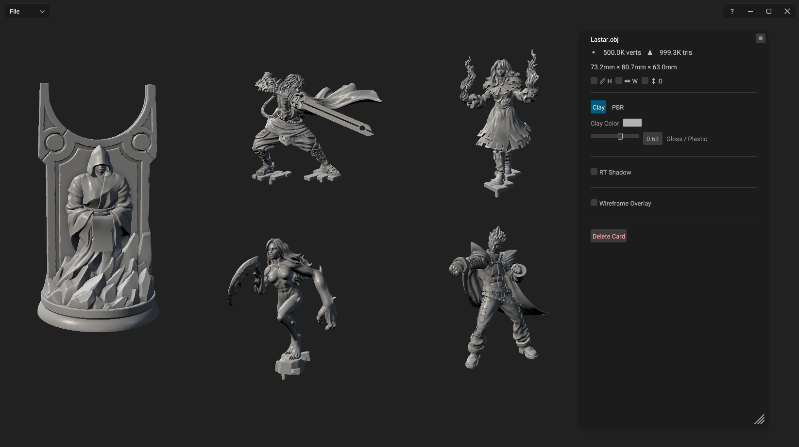

---

## 3. Основы: доска, карточки, меню

### Доска

- **Панорамирование:** зажмите среднюю кнопку мыши и двигайте.
- **Масштабирование:** колесо мыши. Доска будет менять масштаб.

### Карточки

- **Выделить:** клик ЛКМ. 
- **Передвинуть:** ЛКМ двигать карточку по доске.
- **Изменить размер:** Shift + ПКМ и тянуть.
- **Клонировать:** удерживать Alt + ЛКМ и переместить карточку.
- **Удалить:** выделите и нажмите клавишу **Delete**. Исходный файл на диске никак не затрагивается.

### Несколько карточек сразу

- **Выделить несколько карточек:** удерживая ЛКМ, обведите несколько карточек рамкой.
- **Добавить/убрать из выделения:** Ctrl + клик по карточке.
- Выделенная группа двигается и вращается вместе, а меню карточки при мультивыделении применяет изменения ко всей группе. Например, переключить несколько карточек в Clay режим за один раз или поворачивать одновременно несколько моделей для сравнения.

### Два меню

Почти всё управление собрано в двух контекстных меню:

- **ПКМ по карточке** → меню карточки: шейдинг, материал, текстурные слоты, UV, тени. Заголовок - имя модели, под ним счётчики вершин/треугольников и габариты.
- **ПКМ по пустому месту** → меню доски: цвет фона, сетка, виньетка и студийный свет.

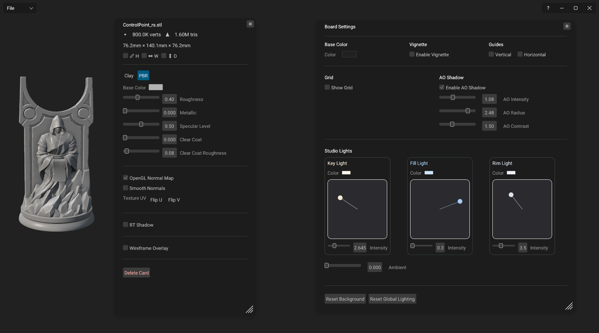

Оба меню это плавающие окна: их можно таскать за заголовок, растягивать за край и **закреплять булавкой** (закреплённое меню не закроется, пока вы работаете с доской). 
**Ctrl + колесо** над меню меняет масштаб его содержимого.

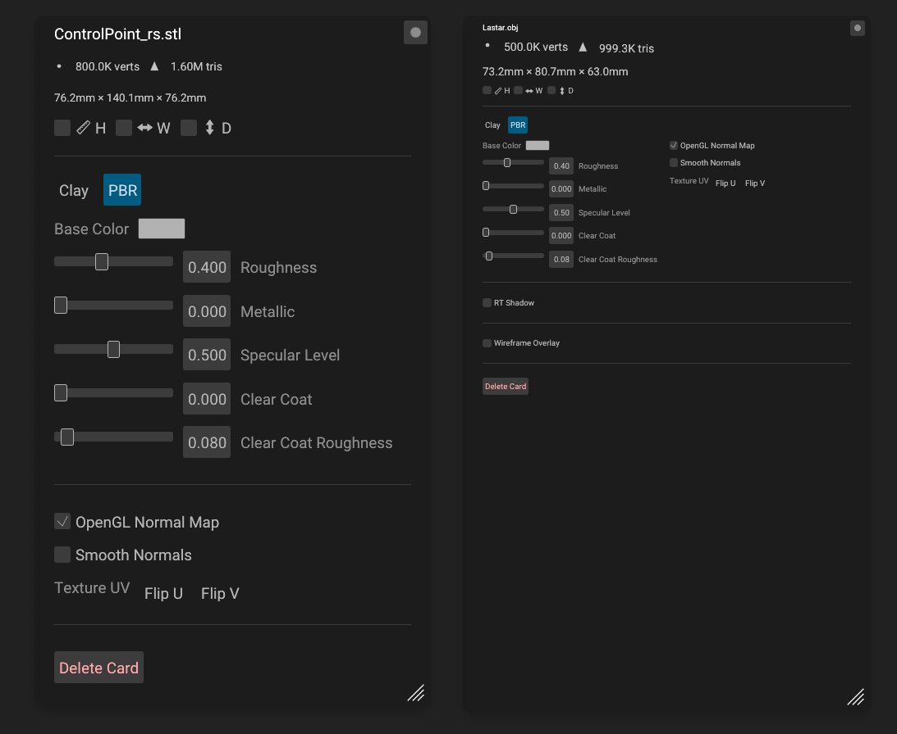

---

## 4. Работа с моделью

### Загрузка

Любым из способов:

- перетащите файл (или сразу несколько) на доску;
- перетащите **папку** - MeshGarage рекурсивно импортирует из неё все поддерживаемые модели.
- дважды кликните ЛКМ по пустому месту доски - откроется диалог выбора файла;
- кнопка **File → Open Project or Model...**

Модели импортируются в фоне: карточка появляется сразу, содержимое подгружается. Повторное открытие той же модели происходит мгновенно - работает кэш (см. раздел 15).

| Действие                                              | Как   |
| ----------------------------------------------------- | ----- |
| Отцентрировать выбранную карточку относительно экрана | **F** |
| Сбросить ротацию модели до превоначальной             | **R** |

### Режимы отображения

| Клавиша | Режим       | Для чего                                                                                                             |
| ------- | ----------- | -------------------------------------------------------------------------------------------------------------------- |
| **1**   | **Clay**    | Облегчённый шейдер, где поверхность имеет только Color и Rough/Gloss. Подходит для HighPoly моделей без UV           |
| **2**   | **PBR**     | Полный материал: текстуры, albedo, metallic, roughness, reflections, normal, AO, emission, Alpha (Opacity), Specular |
| **3**   | **Normals** | Цвет - направление нормали. Ошибки сглаживания и перевёрнутые полигоны видны сразу как резкие швы цвета.             |

В Clay меню карточки доступны цвет (**Clay Color**) и слайдер **Gloss / Plastic**; 
горячие клавиши `[` и `]` меняют значение слайдера **Gloss / Plastic** в любом режиме отображения.

#### Настройки PBR-материала

Шейдинг физически корректный (metallic/roughness workflow). Слайдеры в меню карточки:

- **Base Color** - цвет поверхности. Если карта Albedo включена, работает как тонировка поверх неё. Чистый белый - текстура без изменений.
- **Roughness** - шероховатость поверхности: 0 - полированная, блики резкие и яркие; 1 - матовая, блики широкие и тусклые. Если используется карта Roughness, то значение берётся из текстуры.
- **Metallic** - металличность: 0 - диэлектрик (пластик, дерево, ткань), 1 - металл, отражения окрашиваются в цвет поверхности. Как и Roughness, уступает приоритет включённой карте Metallic.
- **Specular Level** - сила отражений для неметаллов. Полезен для кожи, ткани, шероховатых материалов; на чистом металле не влияет.
- **Clear Coat** - второй глянцевый слой поверх основного материала: автомобильный лак, покрытый лаком пластик, мокрая поверхность.
- **Clear Coat Roughness** - размытость бликов этого слоя: 0 - зеркальный лак, 1 - матовое покрытие.

### Информационные опции

В меню карточки:

- **Wireframe Overlay** - рёбра сетки поверх шейдинга. Показывается **исходная сетка из модели**.  Для мешей тяжелее 5 миллионов треугольников Wireframe недоступен.
- Счётчики **вершин и треугольников** в шапке меню карточки.
- Галки **H / W / D** включают линейки высоты, ширины и глубины прямо возле модели на доске. Единицы измерения отображают точные физические размеры для 3D печати.

### Сглаживание нормалей

Если в файле нет авторских нормалей (сканы, STL, CAD-экспорт), в меню карточки появляется опция **Smooth Normals** - автоматическое сглаживание. MeshGarage никогда не подменяет авторские группы сглаживания.

> **Примечание.** Модели с UV, нормалями или текстурами MeshGarage вообще не изменяет. Все оптимизации происходят только на стороне отрисовки.

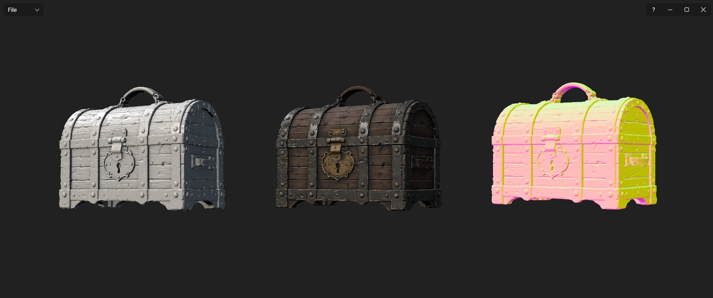

---

## 5. Свет

Свет в MeshGarage **общий для всей доски**: модели освещены одинаково, поэтому их можно честно сравнивать. Схема освещения классическая, трёхточечная: 
**key** (основной), 
**fill** (заполняющий), 
**rim** (контровой).

### Изменение положения и яркости источников света горячими клавишами

1. Удерживайте **Q** и двигайте мышь - **key light** следует за курсором в передней полусфере модели.
2. Колесо мыши при зажатой **Q** - яркость источника света.
3. Отпустите клавишу - свет зафиксирован.
4. **W** - то же самое для **fill** (расположение в передней полусфере), 
5. **E** - для **rim** (перемещается всегда за моделью в задней полусфере).

### Более точные настройки света из меню доски

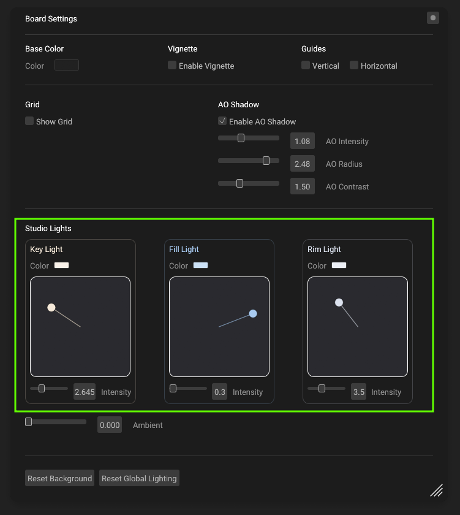

Кликните ПКМ по пустой доске. В секции **Studio Lights** - три панели: **Key Light / Fill Light / Rim Light**, у каждой есть позиционный Gizmo, яркость и цвет света. Кнопка **Reset Global Lighting** возвращает свет к настройкам по умолчанию.

> **Совет.** Рабочая связка: тёплый key + холодный fill + нейтральный rim. Если нужно точно оценить цвет текстур - сделайте весь свет белым.

**Ambient** - равномерная подсветка всех поверхностей. Держите низким для драматичного света, повышайте для ровного "каталожного" освещения

### Трассированные тени (RT Shadow)

Для придания глубины моделям, можно включить честные контактные AO тени, посчитанные трассировкой лучей:

1. Меню карточки → галка **RT Shadow**.
2. Тень уточняется прогрессивно (рядом виден счётчик проходов); шум уходит за пару секунд.
3. **RT Shadow Strength** - плотность тени 
4. **RT Shadow Color** - цвет тени.

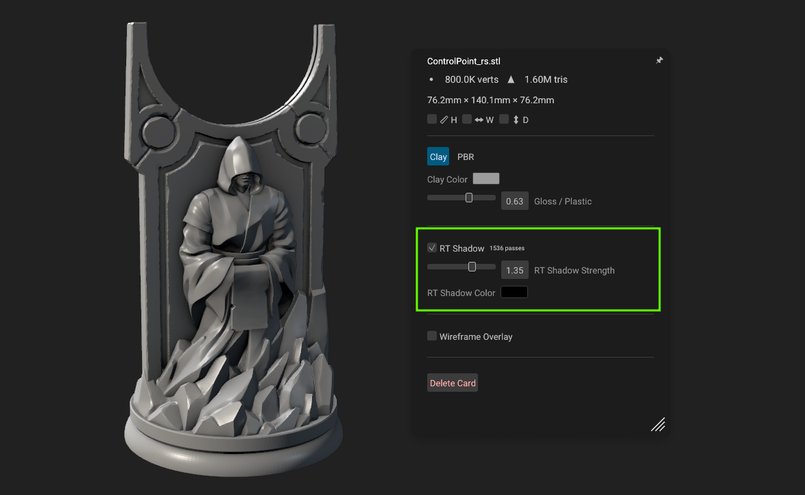

Тени считаются для каждой карточки отдельно и пересчитываются при вращении модели. 
>**Примечание**. Для беглого просмотра десятков моделей включать не стоит.

### AO Shadow

Альтернативная опция для создания Realtime AO теней использующая алгоритм GTAO. Опция находится в мнею доски и применяется сразу для всех моделей на доске.

- **Enable AO Shadow** - включить эффект.

- **AO Intensity** (0-3) - насколько тёмное затенение: 0 - эффекта нет, 1 - естественный уровень, выше - стилизованный.

- **AO Radius** (0.05-3) - насколько далеко затенение «дотягивается» от каждой точки: малый радиус - тонкие тени в узких щелях и складках, большой - широкое затенение крупных полостей.

- **AO Contrast** (0.2-4) - резкость границы затенения: чем выше, тем жёстче края теней.

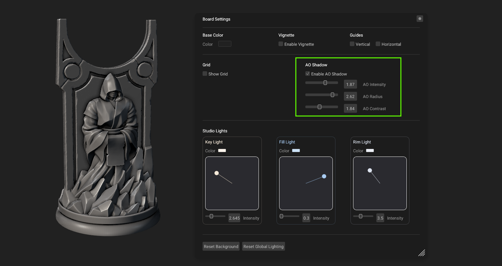

---

## 6. Текстуры и материалы

Откройте меню карточки (ПКМ по карточке с моделью) - секция **Texture Slots**. Если у модели нет UV тайлов то секция будет скрыта.

### Слоты

Восемь слотов: **Albedo, Normal, Metallic, Roughness, AO, Emissive, Alpha, Specular**. При импорте модели они заполняются автоматически: из материала модели, из соседних папок с текстурами, из `.mtl` у OBJ, из встроенных текстур GLB. Для автоматического распознавания, текстуры должны иметь суффиксы соответствующие слотам (например `robot_normal.png` или  `robot_ao.png`). 

В противном случае, текстурные карты можно перетащить в слоты мышкой или кликнув по слоту выбрать на диске.

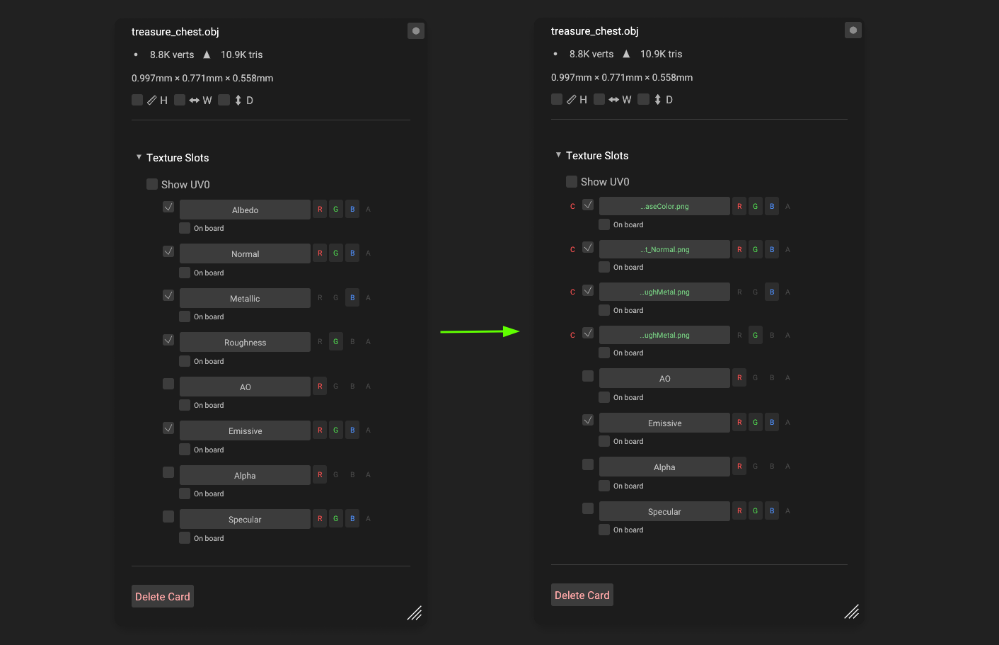

У каждого слота:

- **чекбокс** - временно выключить карту (путь не теряется). Быстрый способ понять, что именно даёт normal map: выключил, включил, сравнил;
- **C** (clear) - очистить слот;
- **R / G / B / A** - из какого канала текстуры брать данные;
- переключатель **UV-канала** (UV0/UV1/UV2) - какую развертку использовать для загрузки текстур. Каждый UV канал имеет свои слоты для загрузки текстур. Если у модели есть больше одного UV канала, то в Texture Slots отображаются вкладки кажадого канала;
- **on board** - чекбокс включает отображение текстуры на доске в виде ноды идущей от модели.

Если у модели несколько материалов, в меню будет вкладка для каждого; зелёный край вкладки это кнопка которая скрывает геометрию соответствующего материала.

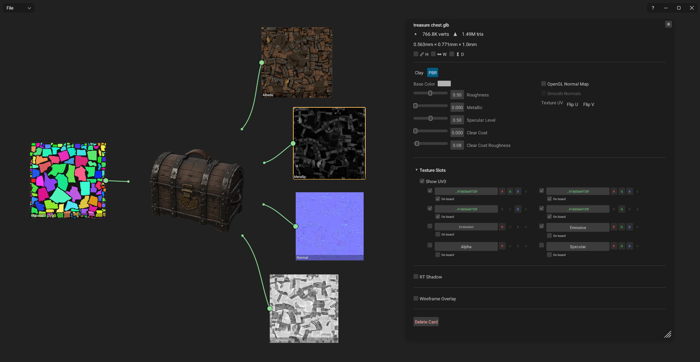

### Упакованные текстуры (ORM)

Metallic, roughness и AO часто запечены в одну текстуру по каналам. Загрузите во все три слота один и тот же файл и выберите соответствующие каналы (**AO → R**, **Roughness → G**, **Metallic → B**).

### Если модель выглядит неправильно

* **OpenGL Normal Map** - переключение отображения карты Normal Map в формат  **OpenGL**
* **Flip U / Flip V** - отзеркаливание текстуры по двум осям.

### Подмена текстур

Встроенные текстуры .GLB ведут себя так же, как файлы - их тоже можно подменять и возвращать кнопкой **C**.

---

## 7. UV и UDIM

UV-инструменты появляются только у моделей, в которых есть развёртка.

### Посмотреть развёртку

1. Меню карточки → секция **Texture Slots** → галка **Show UV** (рядом указан активный UV-канал).
2. На доске рядом с карточкой появятся нода с UV-раскладкой, соединённые с ней линией.
3. Ноды - обычные объекты доски: двигаются ЛКМ, растягиваются за углы.

Если у модели несколько UV-каналов (лайтмап, detail-слой), они отображаются в виде вкладок. Каждая вкладка имеет зеленый переключатель справой стороны. Если он активен (зеленый цвет) то этот канал всегда будет отображаться поверх предыдущих. Разные UV каналы часто используют для декалей или запеченного света.

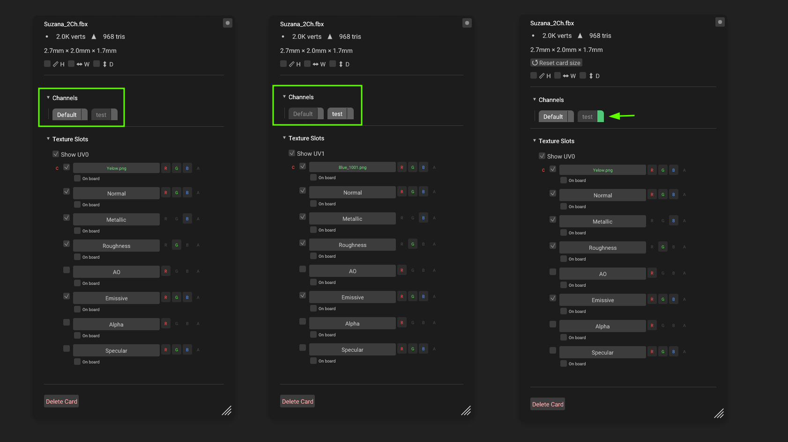

### UDIM

Если развёртка занимает тайлы 1001, 1002, ...  MeshGarage определит это сам. Что позволяет закинуть соответствующий набор UDIM текстур в один слот. Так же, под каждым слотом появится чекбокс **Manual UDIM**. Если его активировать то слот разделится на несколько небольших поиток, для ручной загрузки текстур под каждый тайл. Назначенные тайлы подсвечены зелёным.

> **Примечание.** Если UV острова разбросаны далеко за пределами тайлов без всякой системы, MeshGarage считает развёртку неупакованной и прячет UDIM-инструменты, чтобы не показывать бессмысленные настройки.

[СКРИНШОТ: Карточка с Show UV и сеткой UDIM-нод; на слоте бейдж UDIM ×4]

---

## 8. Наведение порядка: Outliner, референсы, заметки

### Outliner - скрыть части модели

Нажмите клавишу **O** - слева откроется панель со структурой всех карточек: **карточка → материалы → геометрия на которую назначен какой либо материал**. Имена геометрии приходят из исходного файла.

Клик по зеленому квадратику скрывает, выбранный элемент - например, необходимо посмотреть персонажа без шлема. Повторный клик возвращает.

### Растровые изображения

На доску так же можно перетаскивать файлы с растровыми изображениями. Например для сверки 3D моделей с концептами или просто в качестве референсов. 

- Перетащите изображение (`.png`, `.jpg`, `.tga`, `.bmp`, `.tiff`, `.webp`) на доску.
- Перемещение карточки - **ЛКМ** 
- Изменение размера карточки - удерживать **Shift + ПКМ** и двигать мышь.
- Поочередное нажатие **Alt + ЛКМ** скрывает и оторбражает: имя файла → разрешение → обе подписи. 

### Текстовые заметки

1. Нажмите **T** - курсор станет текстовым. Колесо мыши в этом режиме задаёт размер шрифта перед тем как кликнуть по доске и начать печатать.
2. Кликните по пустому месту и начинайте печатать.
3. **Esc** - выйти из текстового режима.
4. Отредактировать существующую заметку: выделить и дважды кликнуть по ней ЛКМ (или кликнуть карандаш рядом с ней в Outliner).
5. Размер заметки: **Shift + ПКМ** 

Если вставить текст на доску через **CTRL+V** из буфера обмена, то заметка будет создана автоматически.

[СКРИНШОТ: Outliner слева со скрытой частью модели; на доске референс и заметка]

---

## 9. Сохранение и обмен

### Два формата проекта

Меню открывается кликом по плашке **File** в левом верхнем углу.

|                    | `.meg` — Save File...                                           | `.meprj` — Save Project...                                                                                                               |
| ------------------ | --------------------------------------------------------------- | ---------------------------------------------------------------------------------------------------------------------------------------- |
| Что внутри         | Раскладка доски, настройки и **ссылки** на файлы в ваших папках | Раскладка, настройки и **сами файлы**: модели и текстуры раскладываются по попкам с корректным именованием и упаковываются в один архив. |
| Когда использовать | Личная работа на своём компьютере                               | Отправить коллеге, заархивировать, перенести на другую машину                                                                            |

Открыть проект: **File → Open Project or Model...**, двойной клик по файлу в проводнике или просто перетащить `.meg` / `.meprj` на окно. Перед заменой текущей доски программа спросит подтверждение.

[СКРИНШОТ: Меню File: Open Project or Model / Save File / Save Project / Clear Cache]

---

## 10. Настройка горячих клавиш

Все клавиши и жесты можно переназначить: кнопка **?** в шапке окна → **About** → **Keyboard Shortcuts**.

В окне три блока:

- **Keyboard keys** - клавиши действий (свет, режимы отображения, инструменты). Клик по полю - и нажмите новую клавишу.
- **Modifier keys** - модификаторы жестов мыши: клонирование, мультивыделение, изменение размера, масштаб меню.
- **Mouse buttons** - какая кнопка панорамирует доску и какая перетаскивает окно.

Кнопка **Reset to defaults** возвращает всё как было.

---

## 11. Справочник: мышь и клавиатура

### Мышь

| Действие               | Где                | Результат                                |
| ---------------------- | ------------------ | ---------------------------------------- |
| ЛКМ клик               | карточка           | Выделить                                 |
| ЛКМ drag               | карточка           | Передвинуть карточку / группу            |
| Alt + ЛКМ drag         | карточка           | Клонировать и тащить копию               |
| Ctrl + ЛКМ клик        | карточка           | Добавить/убрать из мультивыделения       |
| ЛКМ drag               | пустая доска       | Рамка выделения                          |
| Двойной ЛКМ            | пустая доска       | Диалог открытия файла                    |
| ПКМ клик               | карточка           | Меню карточки                            |
| ПКМ drag               | карточка           | Вращение камеры                          |
| Shift + ПКМ drag       | карточка, референс | Изменение размера                        |
| ПКМ клик               | пустая доска       | Меню доски                               |
| ПКМ drag               | пустая доска       | Передвинуть окно программы               |
| Средняя кнопка drag    | везде              | Панаромирование доски                    |
| Колесо                 | везде              | Зум доски к курсору                      |
| Колесо + зажатая Q/W/E | -                  | Яркость соответствующего источника света |
| Ctrl + колесо          | над меню           | Масштаб содержимого меню                 |
| Alt + клик             | картинка           | Переключить подпись (имя/разрешение)     |

### Клавиатура (по умолчанию)

| Клавиша                            | Действие                                                 |
| ---------------------------------- | -------------------------------------------------------- |
| **Q** / **W** / **E** (удерживать) | Key / Fill / Rim light: мышь - позиция, колесо - яркость |
| **1** / **2** / **3**              | Режим Clay / PBR / Normals                               |
| `[` / `]`                          | Шероховатость меньше / больше                            |
| **F**                              | Отцентрировать выбранные элементы на доске               |
| **R**                              | Сбросить угол камеры для 3D карточек                     |
| **O**                              | Панель Outliner                                          |
| **T**                              | Инструмент заметок                                       |
| **Delete**                         | Удалить выделенное                                       |
| **Esc**                            | Выйти из инструмента заметок                             |

---

## 12. Меню доски (ПКМ по пустому месту)

| Блок          | Содержимое                                             |
| ------------- | ------------------------------------------------------ |
| Base Color    | Цвет фона доски                                        |
| Vignette      | Затемнение по краям                                    |
| Guides        | визуальное разделение доски по горизонтали и вертикали |
| Grid          | Фоновая сетка                                          |
| AO Shadow     | AO тень для 3D моделей в релаьном времени              |
| Studio Lights | Key / Fill / Rim: гизмо позиции, яркость, цвет         |
| Футер         | Reset Background, Reset Global Lighting                |

---

## 13. Поддерживаемые форматы

### Модели

| Формат     | Геометрия | Материалы и текстуры                         | Несколько UV-каналов |
| ---------- | --------- | -------------------------------------------- | -------------------- |
| glTF / GLB | да        | полный PBR, включая встроенные текстуры      | да                   |
| FBX        | да        | да, плюс автопоиск текстур в соседних папках | да                   |
| OBJ        | да        | через `.mtl` и автопоиск                     | да                   |
| STL        | да        | нет (только геометрия)                       | —                    |

### Изображения (референсы)

`.png`, `.jpg`, `.jpeg`, `.tga`, `.bmp`, `.tiff`, `.webp`

### Проекты

`.meg` (ссылки), `.meprj` (архив). Открываются перетаскиванием, через File → Open или двойным кликом в проводнике.

---

## 14. Частые вопросы и проблемы

**Я переэкспортировал модель. Увижу ли я новую версию?**
Да, автоматически. Кеш привязан к содержимому файла: изменённый файл переимпортируется сам. Если что-то всё же выглядит устаревшим - **File → Clear Cache...** и откройте файл заново.

**Программа стала подтормаживать.**
Иногда очень тяжёлые модели (десятки миллионов полигонов) долго готовятся при первом импорте - это происходит один раз, дальше срабатывает кеш.

---

## 15. Файлы программы: кеш и логи

**Кеш моделей.** Чтобы повторное открытие тяжёлых файлов было мгновенным, модели хранятся в кеше:

- при установке через Setup, по умолчанию весь кэш записывается в `%LOCALAPPDATA%\MeshGarage\cache`). Но при установке, папку можно сменить;
- в portable-версии, кэш записывается в папке `.cache` рядом с `MeshGarage.exe`.

Кеш обслуживает себя сам: изменённые файлы переимпортируются, устаревшие записи удаляются. Полная очистка - **File → Clear Cache...** (с подтверждением); модели просто переимпортируются при следующем открытии.

**Логи.** `MeshGarage.log` рядом с программой — рабочий журнал. `crash_log.txt` появляется только после сбоя.

**Сессия.** Последние настройки доски сохраняются при выходе и восстанавливаются при запуске автоматически.

---

## 16. О программе

Кнопка **?** в правом верхнем углу открывает окно **About**: версия, разработчик, статус беты. Оттуда доступны:

- **Third-Party Licenses** - лицензии стороннего ПО;
- **Keyboard Shortcuts** - просмотр и переназначение всех клавиш и жестов.

К сообщению о проблеме прикладывайте `crash_log.txt` и `MeshGarage.log` (лежат рядом с `MeshGarage.exe`) и, если возможно, сам файл модели.

